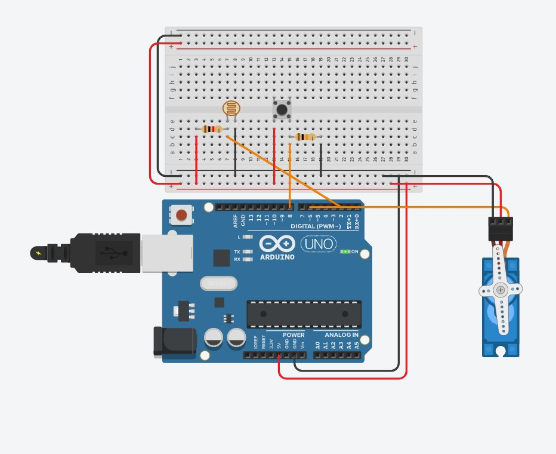

# **Smart Curtain**

The Arduino Project, which is doing open or close curtains effectively. 
* The project includes Interrupt and Timer processes.
* In this project, we used 6 elements which are
  * Arduino UNO
  * 1 Servo
  * 1 Buzzer
  * 3 Button
  * 4 Resistors
  * 1 LDR

  
  
 **Main Scenario**
  
>In the morning, when the light comes, LDR detects the light and sends the interrupt to Arduino then the servo runs. Hence, the curtain will open and light comes in. 

>In the night, when the light goes, LDR detects the light goes, so send the interrupt to Arduino then the servo runs. Hence, the curtain will close.

 

* Circuit Design

> 

In this project, we have two modes which are runs with buttons.
*  First Button (on the left)
   *  When the button pressed, interrupt disabled, then the curtain's position is will be opposite. When the button is pressed one more time, the curtain position becomes normal then interrupt enabled.
* Second Button (on the right)
  * When the button pressed, interrupt disabled, then the curtain's position is will be opposite for ten seconds*. After ten seconds, the curtain position becomes normal, then interrupt enabled.
  * Time option can be changed.